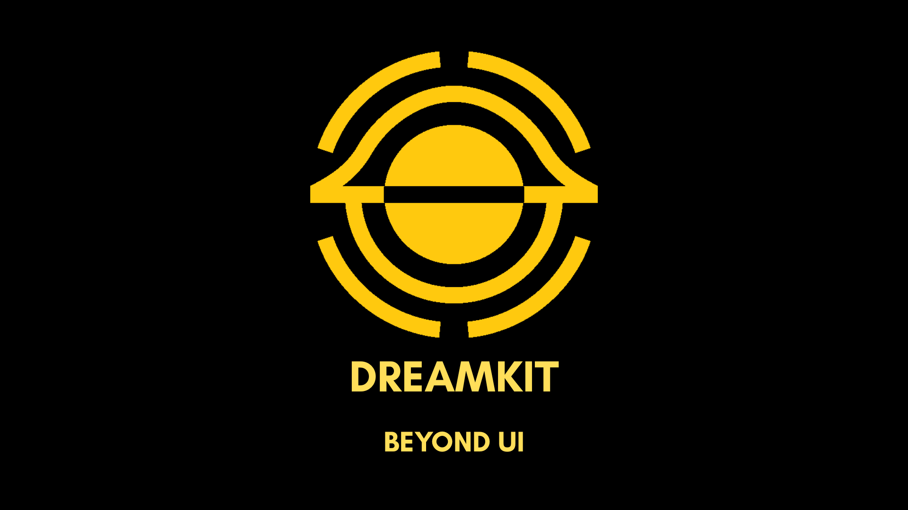

# ✦ DreamKit

### Beautiful animated UI components for modern websites.

DreamKit is a growing collection of animated and interactive UI components for React and Next.js.

**Copy. Paste. Customize. Ship.**

No complicated setup. No runtime dependency. Just beautiful components with source code you can own and customize.

---

  

  <strong>Click the preview to explore DreamKit.</strong>

  <a href="https://dreamkit-phi.vercel.app/">
    → Explore DreamKit
  </a>

---

## ✨ What is DreamKit?

DreamKit is a growing collection of reusable UI components designed for developers who want to build modern, interactive and visually impressive websites without creating every animation from scratch.

The components are designed to be:

- 🎨 Beautiful and modern
- ⚡ Easy to integrate
- 🧩 Reusable and customizable
- 📦 Copy-and-paste friendly
- 💻 Built for React and Next.js
- 🔓 Free to use under the DreamKit custom license

The library currently includes components for:

- 🎨 Backgrounds
- 🔘 Buttons
- 🃏 Cards
- 🖱️ Cursor effects
- 🦸 Hero sections
- ⏳ Loaders
- 📊 Progress components
- and more

New components are being added continuously.

---

## 🚀 How DreamKit Works

DreamKit is designed around a simple workflow:

### 01 — Explore

Browse the DreamKit component library and find something that fits your project.

### 02 — Preview

Interact with the component directly in your browser and see how it behaves.

### 03 — Copy

Copy the component source code directly from the component page.

### 04 — Customize

Change the styles, animations, content and behavior to match your project.

### 05 — Ship

Use the component in your own application and build something great.

> No need to install DreamKit as a package or depend on DreamKit at runtime.

---

## 🧩 Components

### 🎨 Backgrounds

- Animated Grid Background
- Dot Pattern Background

### 🔘 Buttons

- Glow Pulse Button
- Interactive Slide Button
- Shimmer Border Button

### 🃏 Cards

- Glow Card
- Metric Card

### 🖱️ Cursor

- Fluid Glow Cursor
- Interactive Ring Cursor

### 🦸 Hero

- Split Hero

### ⏳ Loaders

- Orbit Spinner Loader
- Pulse Bar Loader

> DreamKit is actively evolving. More components, categories and advanced effects are coming.

---

## 🛠️ Tech Stack

DreamKit is built with:

- Next.js
- React
- TypeScript
- Tailwind CSS
- CSS Animations

---

## 🌐 Live Demo

The best way to experience DreamKit is through the live website.

  

  <a href="https://dreamkit-phi.vercel.app/">
    <strong>→ Open DreamKit</strong>
  </a>

Explore components, preview them live and copy the source code directly into your project.

---

## 💡 Using DreamKit Components

DreamKit is designed to give you the source instead of locking you into a library.

You can:

- Use components in personal projects
- Use components in commercial projects
- Build websites and applications for clients
- Modify and customize the source code
- Adapt components to your own design system
- Include modified components in your applications

The basic idea is simple:

**Find → Copy → Customize → Ship.**

---

## 🤝 Contributing

Contributions, ideas and feedback are welcome.

If you have an idea for a component, animation or improvement that would fit DreamKit, feel free to:

- Open an issue
- Suggest a component
- Report a bug
- Submit a pull request

On this email - dreamkitsupport@gmail.com

DreamKit is being built in public and community feedback is always appreciated.

---

## 📄 License

DreamKit components are provided under a custom UI license.

### You CAN

- Use the components in personal projects
- Use the components in commercial projects
- Build websites and applications for clients
- Modify and customize the source code
- Include modified components in your own applications

### You CANNOT

- Resell DreamKit components as standalone source code
- Redistribute the original components as a competing UI library
- Re-license or sublicense the original DreamKit components
- Package DreamKit components as another template kit or UI library
- Rebrand and publicly distribute the original DreamKit source as your own product
- Create a competing page builder or website-building service based on DreamKit components

For the complete terms and permitted uses, see the
[DreamKit Terms of Use](https://dreamkit-phi.vercel.app/terms).

---

## ❤️ Support DreamKit

DreamKit is free to explore and use under its custom license.

If DreamKit saves you time, helps you build something cool, or you simply want to support the project, you can support its development on Ko-fi.

  

  <a href="https://ko-fi.com/sasha4k">
    <strong>☕ Support DreamKit on Ko-fi</strong>
  </a>

Every bit of support helps me spend more time improving DreamKit and creating new components.

---

## 🗺️ Roadmap

DreamKit is actively being developed.

### Current

- [x] Animated UI component library
- [x] Live component previews
- [x] Copy component source
- [x] Free component collection
- [x] Component categories
- [x] Search and filtering foundation

### Planned

- [ ] More animated UI components
- [ ] More hero sections
- [ ] More interactive backgrounds
- [ ] Advanced cursor effects
- [ ] More complete website sections
- [ ] Templates
- [ ] Improved component discovery
- [ ] Premium components
- [ ] DreamKit Pro
- [ ] User accounts
- [ ] Subscriptions
- [ ] Premium access system

---

## ⭐ Support DreamKit

If you like DreamKit, there are several ways you can help:

⭐ Star the repository  
🐛 Report bugs  
💡 Suggest new components  
🤝 Contribute  
☕ Support the project on Ko-fi

Every star helps more developers discover DreamKit.

---

## 🔗 Links

- 🌐 [DreamKit Website](https://dreamkit-phi.vercel.app/)
- 📦 [GitHub Repository](https://github.com/Oleksandr-Kalynyuk/dreamkit)
- ☕ [Support DreamKit on Ko-fi](https://ko-fi.com/sasha4k)
- 📜 [Terms of Use](https://dreamkit-phi.vercel.app/terms)

---

  Built with ❤️ for the web.

